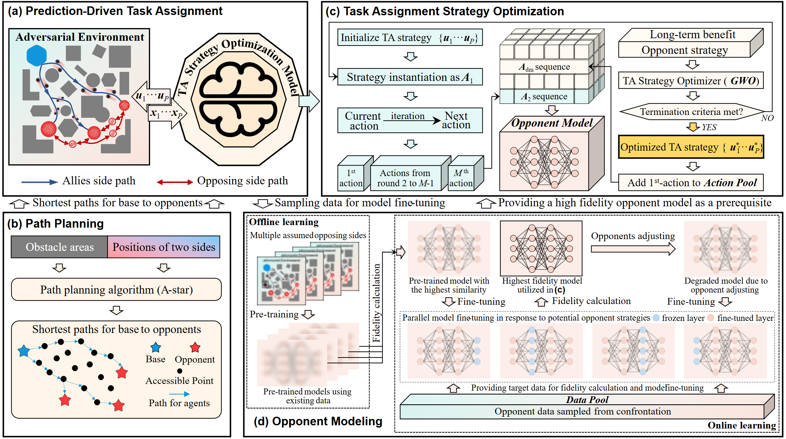

<div align="center">

# Prediction-Driven Task Assignment for Multi-Agent Systems: Rapid Adaptation to Opponent Strategy

</div>

## News

- **2025-10-16**: We provide the python 3.10 compatible PDTA version.
- **2025-05-22**: Code released!

## Introduction
**Prediction-Driven Task Assignment (PDTA)** is developed for multi-agent systems (MASs) operating in adversarial environments, which enables MAS to rapidly adapt to unknown and flexible opponent strategies using limited data.
The key components include:
1. Modular Neural Network-based Opponent Modeling:
A data-efficient model incorporating expert knowledge, designed to identify opponents’ recovery, transfer, and deception strategies with minimal training samples.
Through pre-training and fine-tuning, the model achieves high fidelity and strong interpretability.
2. Prediction-Driven Task Assignment Strategy Optimization:
Using the opponent model, MAS predict long-term outcomes of potential strategies.
The Grey Wolf Optimizer (GWO) is employed to iteratively refine assignments, balancing immediate and long-term benefits under limited resource constraints.
3. Integrated Path Planning via A*:
Ensures that all agents execute optimized assignments through collision-free shortest paths. 

Extensive simulations demonstrate that PDTA improves task execution efficiency by up to 30% compared to conventional and existing prediction-driven methods, while maintaining adaptability against dynamic and deceptive opponents. 



## Prerequisite
- Python >= 3.10

## Installation

```
git clone https://github.com/WZZ-Wangzhaozong/PDTA
cd PDTA
pip install -e .  
```

## Usage
1. Setting the simulation parameters through parameter.py

| Parameter Name       | Type / Default Value                 | Description |
|---------------------|-------------------------------------|-------------|
| Searchwolf_num       | int / 100                           | Total number of search wolves. |
| Max_iter             | int / 10                            | Maximum number of iterations. |
| fine_tuning_epochs   | int / 2000                          | Number of fine-tuning epochs. |
| Environment location | xlsx / data_save\excel_file\env.xlsx | Location of environment Excel file. |
| end_symbol           | float / 0.05                        | Symbol of the end of the adversarial process. |
| C                    | float / 0.024                        | Weakening ability of single agent. |
| Agent_number         | int / 50                             | Number of agents on the allies' side. |
| KO                   | float / 1.2                          | Total weakening ability of the allies' side (C * Agent_number). |
| Duration             | float / 1.0                          | Duration allowed for the opponent's adjustment in each phase. |
| Adv_time             | list / [0.0, 8.0, 9.0, 15.0, 16.0, 20.0, 21.0] | Beginning time of each phase. |
| P                    | list / [8, 8, 8, 8, 8, 6, 6]        | Opponents' number in each phase. |
| x0                   | tensor / ones([P[0]]) * 2.0        | Initial anti-capabilities of opponents. |
| opponents_index      | list of lists                        | Index of opponents in each phase. |
| KE                   | float / 0.16                         | Transfer ability factor. |
| exp                  | float / 3.0                           | Transfer index factor. |
| KR                   | float / 0.012                        | Recovery ability factor. |
| beta                 | np.array / [1.0, 0.6, 1.1]          | Recovery index factor. |
| order                | int / 3                              | Number of elements in beta. |
| Time                 | list / normalized flight times       | Travelling time, normalized by maximum of phase 0. |
| Bij                  | np.array / see code                  | Transfer damping in each phase. |
| Connect_graph        | list of lists                        | Connectivity between opponents in each phase. |
| PNi                  | list of np.array                     | Importance of opponents in each phase. |
| DLi                  | list of np.array                     | Deception factor of opponents in each phase. |

2. Running parameter.py and NN/NN_train.py to generate the networks used for simulations with clear opponents. 

3. Running the desired strategy script from the strategy/ folder. 
    (quantity-based.py->method 1; AST.py -> method 2; TNNLS.py -> method3; TASE.py -> method 4; our -> prediction-driven.py; our-NN -> prediction-driven-NN.py and  prediction-driven-NN-deception.py)
    It be noted that the model fine-tuning and the opponent strategy recognization are presented both in prediction-driven-NN.py and prediction-driven-NN-deception.py.

4. Running data_save/npy_to_excel.py to save data, including trajectories of opponents' anti-capabilities, TA processes, etc. 
   
## License
This project is released under the MIT License, see [LICENSE.txt](LICENSE.txt).


## Author
Wang Zhaozong is a Ph.D. student at the Beihang University, interested in decision-making on multi-agent systems. 